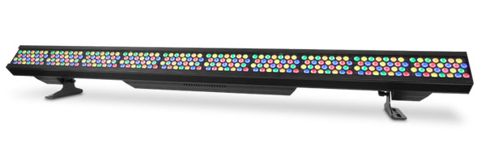
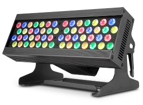
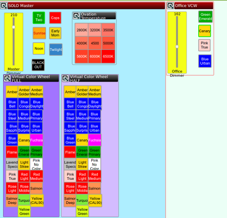
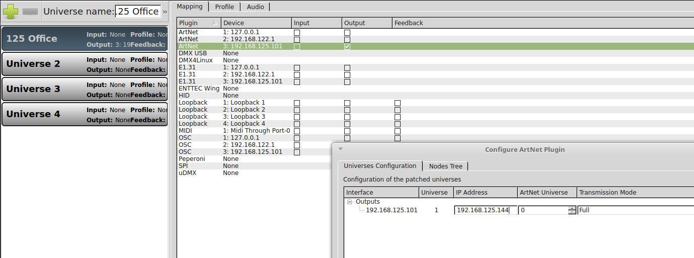
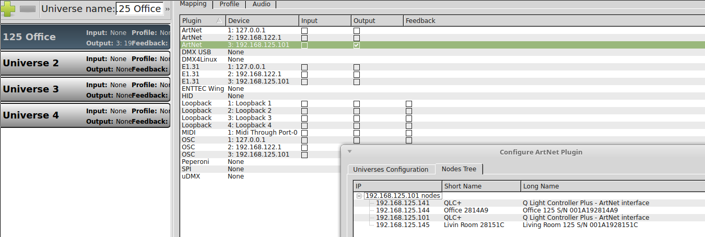

## Q Light Controller, README  

Residential Use  
06/01/2018

## Overview

[Back to Top](#top)

This is an implementation project using [Q Lighting Controller+](http://www.qlcplus.org) by [Massimo Callegari](https://github.com/mcallegari).  The files here were created in the Q Light Controller+ v.4.10.5 console for fixtures and universe settings. These files are used daily to control lighting in a living room and home-office.

The headless server is running Ubuntu 16.04, Xenial in a virtual box.  The local-area-network has two DMXKing eDMX controllers running ArtNet.  The fixtures driven by `qlcplus` are described below.

Once launched in `xfvb`, the controller is accessible from a desktop, laptop, smart-phone, or tablet by pointing at the IP address for the virtual box on port 9999.

`192.168.111.111:9999`

## Fixtures

[Back to Top](#top)

The following fixtures are utilized in each of these two environments.

**B-2805FC**

-   Ovation B-2805FC
    1.  Light Source: 280 LEDs (60 red, 60 green, 60 blue, 40 amber,
        60 lime) 8 W, (740 mA), 50,000 hrs life expectancy
    2.  Color Temperature (range): 2800K to 6500K
    3.  Dimensions: 69 x 8.26 x 8.13” (1,753 x 210 x 207 mm)
    4.  Weight: 45.4 lb.

**B-565FC**
-   Chuvet Ovation B-565FC
    1.  Light Source: 56 LEDs (12 red, 12 green, 12 blue, 8 amber,
        12 lime) 8 W, (740 mA), 50,000 hrs life expectancy.
    2.  Color Temperature (range): 2800K to 6500K.
    3.  Dimensions: 13.9 x 7.48 x 8.14”
    4.  Weight: 11.6 lb.

## Available\_Files

[Back to Top](#top)

### Fixture Definition Files

[Back to Fixtures](#fixtures) / [Back to Top](#top)

**133-qlc-editor-version-ovation-b-2805fc-plexFix.qxf** — Ovation B-2805FC, all 135 channels with the following personalities available:
-   2-Cell RGBAL EXT, 19CH
-   2-Cell RGBA EXT, 17CH
-   2-Cell RGB EXT, 15CH
-   2-Cell RGBAL, 10CH
-   2-Cell RGBA, 8CH
-   1-Cell RGBAL Full, 17CH
The additional personalities listed below are required to complete this fixture file and will be added to a newly named file as time permits.  The thirty-two personalities available for this fixture can be found in the B-2805FC manual in the [Resources and Manuals subdirectory, \#439](./resources-and-manuals/).

#### To-be-completed Personalities

##### 10-Cell Personalities
-   10-Cell RGBAL Full, 135CH
-   10-Cell RGBAL Fine, 100CH
-   10-Cell RGBAL EXT, 83CH
-   10-Cell RGBA EXT, 73CH
-   10-Cell RGB EXT, 63CH
-   10-Cell RGBAL, 50CH
-   10-Cell RGBA, 40CH
-   10-Cell RGB, 30CH
##### 5-Cell Personalities
-   5-Cell RGBAL Full, 70CH
-   5-Cell RGBAL Fine, 50CH
-   5-Cell RGBAL EXT, 43CH
-   5-Cell RGBA EXT, 38CH
-   5-Cell RGB EXT, 33CH
-   5-Cell RGBAL, 25CH
-   5-Cell RGBA EXT, 20CH
-   5-Cell RGB, 15CH
##### 2-Cell Personalities
-   2-Cell RGBAL Full, 31CH
-   2-Cell RGBAL Fine, 20CH
##### 1-Cell Personalities
-   1-Cell RGBAL Fine, 50CH
-   1-Cell RGBAL EXT, 43CH
-   1-Cell RGBA EXT, 38CH
-   1-Cell RGB EXT, 33CH
-   1-Cell RGBAL, 5CH
-   1-Cell RGBA, 4CH
-   1-Cell RGB, 3CH
-   1-Cell DMX-VCW-CCT, 3CH

### Universe Settings

[Back to Top](#top)

**171-operational-lr-office-875.qxw** — Operational two universe QXW controller file.  \#171 runs either stand alone in the Q Light Controller console or on a headless server for web-based control.  The headless server is started using  panel when started with: 
`xvfb-run qlcplus -w -p -g -o /qlightingPlus/171-operational-lr-office-875.qxw`

A larger image is available in the [images subdirectory as \#221](./images/221-qlcplus-controller.png).  

In order for the qxw-file to find the fixture details, the referenced fixture-name must be in the directory `~/.qlcplus/fixtures`.  The fixture name is found within name tags in the fixture file (\#133) as: 
`<Name>Ovation B-2805FC-133-plexLMhome.qxf</Name>`

This odd name is used in order to find the controlling file more easily for demonstration purposes, i.e., including \#133 in the fixture name.  Once completed the fixture's actual name can be used without reference to the source filename.

**Port 9999 Created with \#171**

#### ArtNet Considerations
With separate IP  addresses for each of the DMXKing eDMX controllers, each universe can point at its own.  These IP addresses can be seen on the office test version of the nearby "Inputs/Outputs" screen.  The two eDMX controllers at 192.168.125.144 (Office) and 192.168.125.145 (Living Room) can be seen on the "Inputs/Outputs" entitle, Office Test Configuration -- Nodes, along with the QLC ArtNet interfaces at .141 and .101.

Office Test Configuration -- Universes

Office Test Configuration -- Nodes

